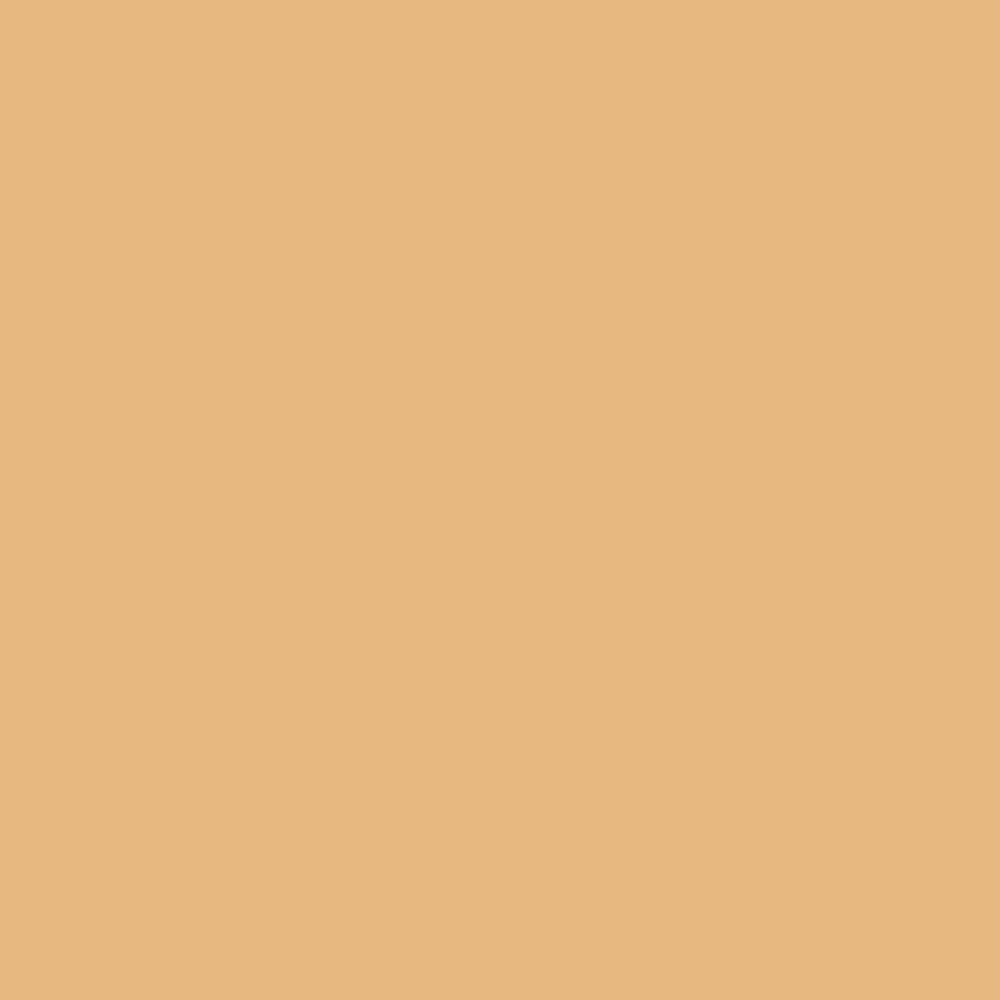
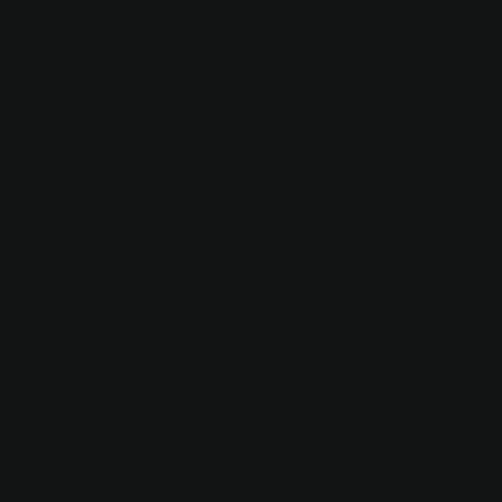
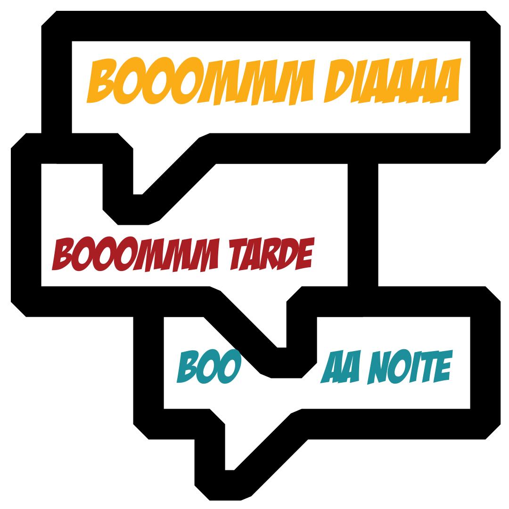
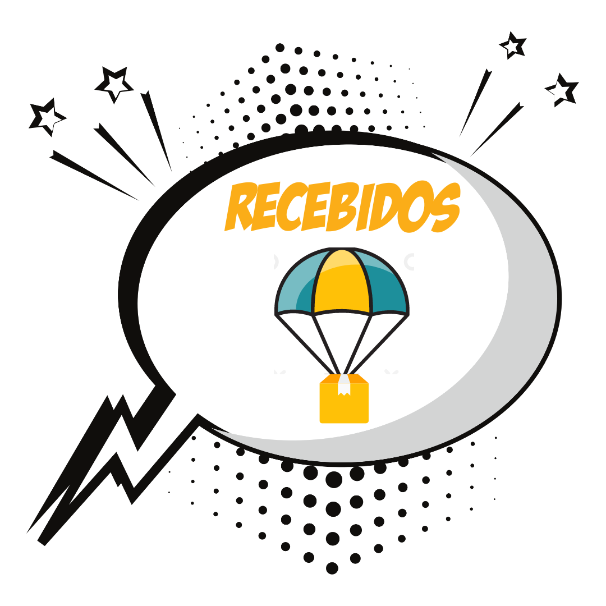
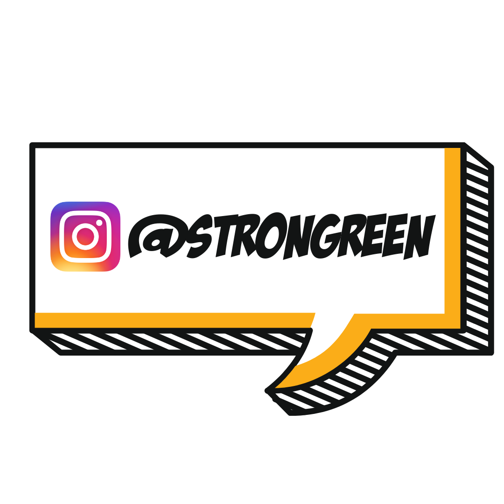
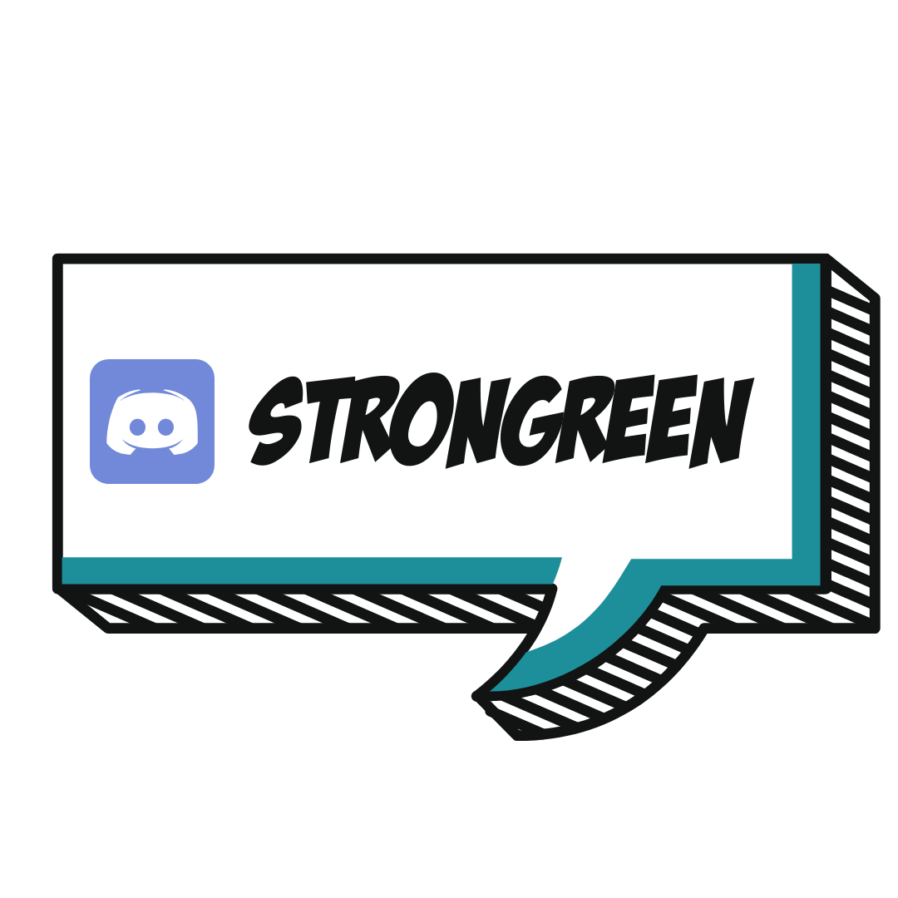
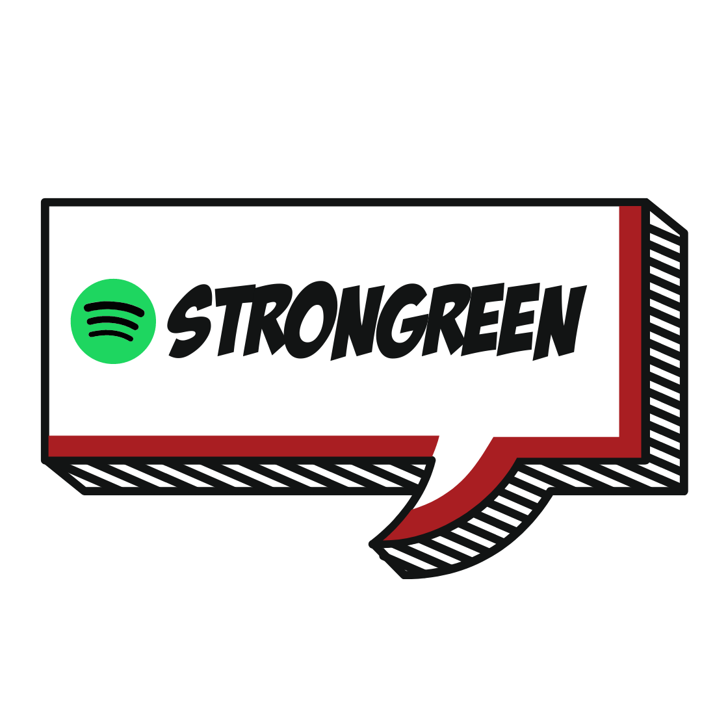
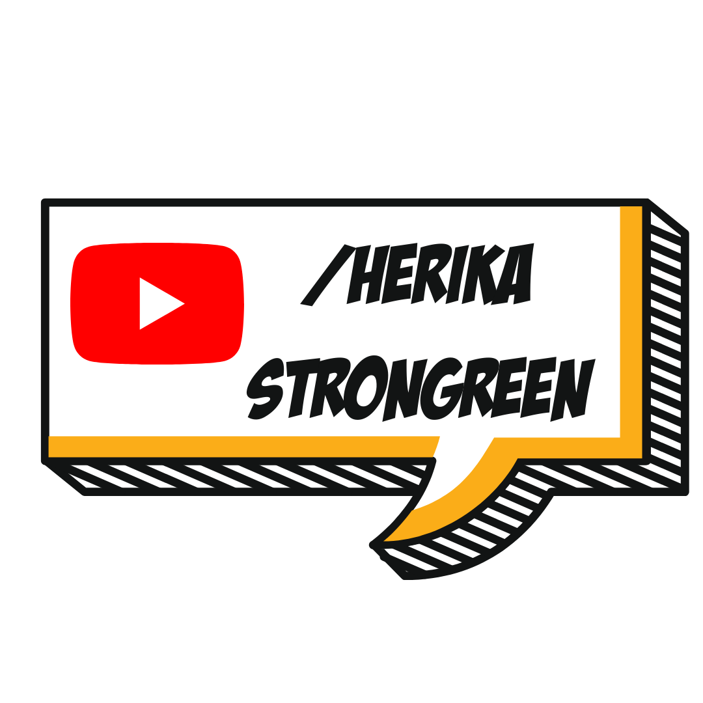
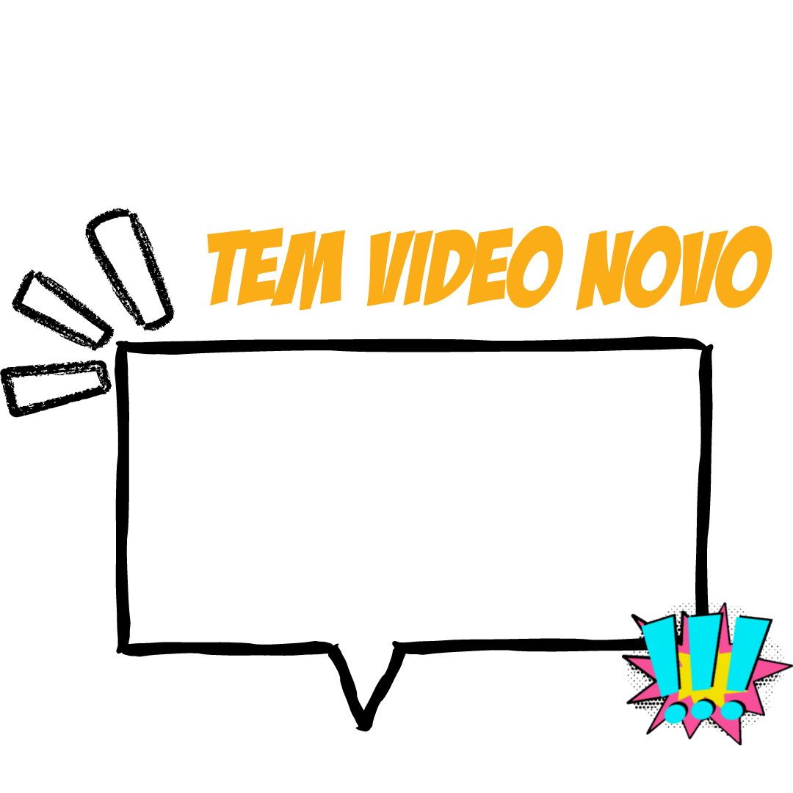

# Guia-de-Marca

Esse é o guia da marca Ströngreen, aqui você encontra todas as artes, informações, estilos que são utilizados atualmente. 

A marca Ströngreen é uma marca registrada no INIP, então utilize com consciência :)

## Informações importantes antes do uso:
  - Não modifique ou altere o logotipo ou qualquer especificação fornecida nesta documentação.
  - Comunique a equipe antes de disponibilizar.
  - Não use em locais onde a equipe não tenha autorizado em termos de patrocínio para eventos ou endossos.
  - A utilização não é permitida em projetos que não sejam de código aberto, salvo aprovação antecipada e explicita.
  - Utilize sempre as especificações oficiais e não modificados para representar a marca.
  - Não gire ou altere o alinhamento, transparência ou direção dos elementos da marca.
  - Não altere as cores dos elementos da marca.

## Padrões de Fontes

Caso queira utilizar uma das fontes da marca:

| Nome | Uso |
|---------|----------|
|[Badaboom](https://github.com/Strongreen-Company/Guia-de-Marca/blob/main/Fontes/BADABB__.TTF)| Usada nos títulos. 
|[Comix Loud](https://github.com/Strongreen-Company/Guia-de-Marca/blob/main/Fontes/Comix%20Loud.ttf)| Usada para destaques 
|[IntroRust](https://github.com/Strongreen-Company/Guia-de-Marca/blob/main/Fontes/IntroRustG-Base2Line.otf)| Usada para textos 
|[Aldo the Apache](https://github.com/Strongreen-Company/Guia-de-Marca/blob/main/Fontes/AldotheApache.ttf)| Usada na logo 

## Paleta de cores

| Paleta | Hexadecimal| RGB | Uso |
|---------|----------|------- | -------|
||#fbad18|151 212 217| Principal       |
||#1d8f9b|232 184 129| Secundária      |
||#e8b881|254 175 190| Destaques       |
||#121414|18  20  20 | Detalhes        |
||#a91e22|230 142 123| Destaque        |
||#ffffff|255 255 255| Detalhes        |

## Manual de utilização da Marca

Pode ser acessado [aqui](https://github.com/Strongreen-Company/Guia-de-Marca/blob/main/ManualdeIdentidadeVisual_STRONGREEN.pdf)

## WallPaper Ströngreen

Caso queira utilizar o [Wallpaper](https://github.com/Strongreen-Company/Guia-de-Marca/blob/main/Wallpaper.png)

## Imagens e elementos da identidade visual

Pode ser acessado [aqui](https://github.com/Strongreen-Company/Guia-de-Marca/tree/main/Elementos)

## Balões mais utilizados

| Prévia |  Uso | Prévia |  Uso |
|---------|-------|---------|-------|
|| Boom diaa       | | Ideia           |
|| Recebidos       | | Instagram         |
|| Discord        | | Spotify        |
|| Youtube Se Inscreve       | | Youtube        |
|| Video Novo        | | Falando com Maker - Quadro

